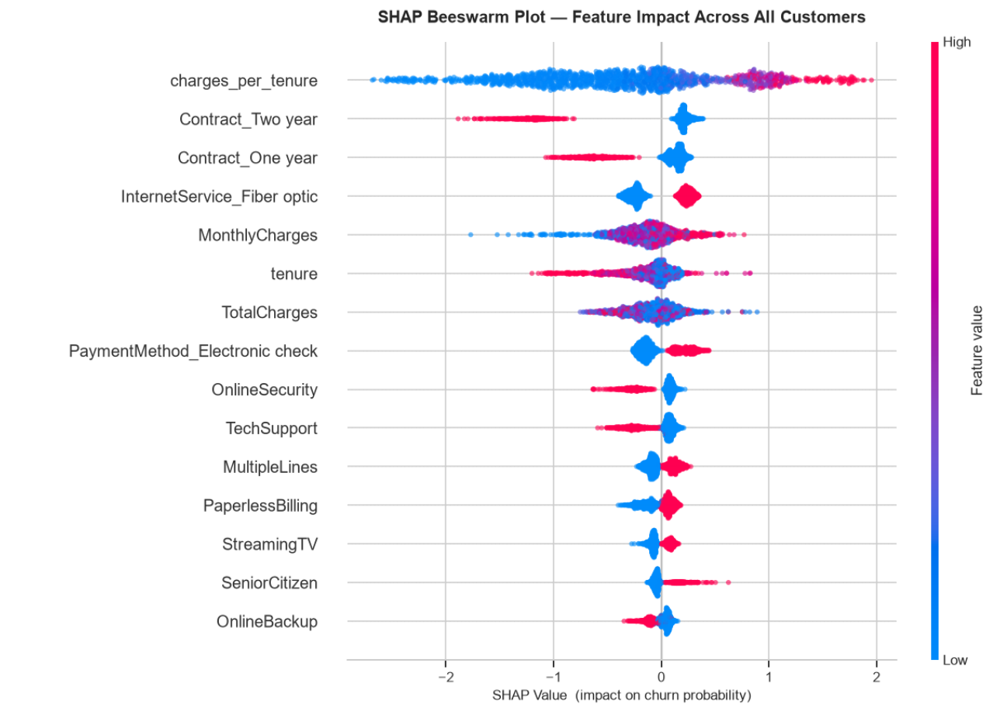
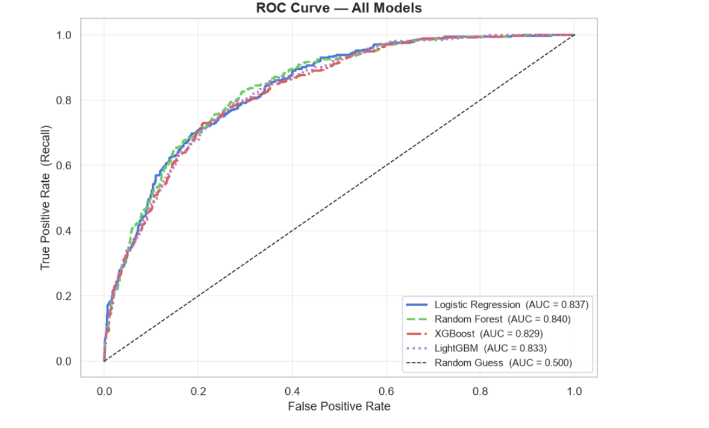
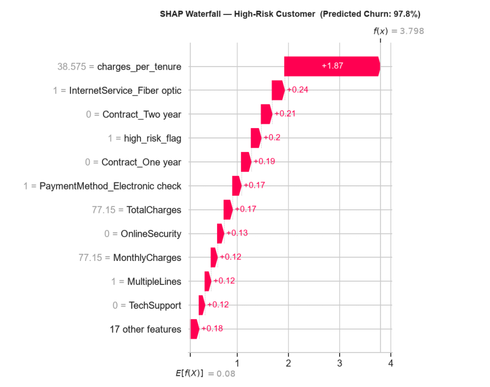
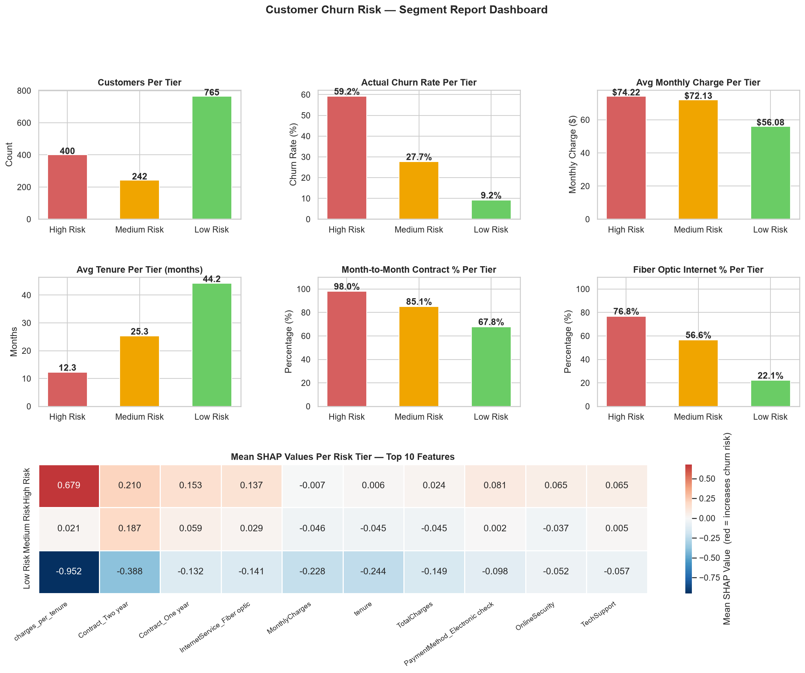

# Customer Churn Prediction with Explainability

> Predicting which telecom customers are about to cancel — and explaining exactly why — so the retention team can act before it is too late.

---

## The Business Problem

A SaaS telecom company loses roughly 26% of its customers every month. Acquiring a new customer costs 5–7x more than retaining an existing one. The retention team has budget, agents, and offers ready — but no way of knowing which customers to call, or what to say when they do.

This project solves that. It builds a machine learning pipeline that outputs:

1. A churn probability score for every customer
2. A plain-English explanation of why that customer is flagged
3. A risk-tiered segment report with specific retention actions per group

The output is not a model metric. It is a Monday morning list the retention team can act on immediately.

---

## Key Results

| Model | AUC Score | Churn Recall | Churn F1 |
|---|---|---|---|
| Logistic Regression | 0.835 | 0.797 | 0.610 |
| Random Forest | 0.818 | 0.652 | 0.590 |
| XGBoost (tuned) | 0.840 | 0.712 | 0.625 |
| LightGBM | 0.831 | 0.698 | 0.618 |

**Selected model: XGBoost (tuned via GridSearchCV + RandomizedSearchCV)**  
Chosen for highest AUC and best balance of churn recall with manageable false alarm rate.

---

## SHAP Global Explainability

The model is not a black box. SHAP (SHapley Additive exPlanations) decomposes every prediction into individual feature contributions — globally across all customers, and locally for each individual.



**Reading this chart:** Each dot is one customer. Position on the x-axis shows how much that feature pushed the prediction toward or away from churn. Colour shows the feature's value (red = high, blue = low).

**Top findings:**
- Month-to-month contracts are the single strongest churn driver
- Fiber optic internet customers churn at 42% despite paying premium prices
- Customers in their first 12 months are at 2x the risk of loyal customers
- Higher monthly charges combined with short tenure = highest risk profile

---

## ROC Curve — All Models



---

## Individual Customer Explanation

For any customer flagged as high risk, the model generates a waterfall chart showing exactly which features drove that specific prediction — not just a global average.



This is converted into a plain-English retention brief:

```
CUSTOMER RETENTION BRIEF
Risk Tier           : HIGH RISK
Churn Probability   : 81.4%
Tenure              : 4 months
Monthly Charge      : $91.20
Contract Type       : Month-to-month
Primary Drivers     : Contract type, Fiber optic internet, Early tenure
Recommended Action  : Priority call — annual plan upgrade + loyalty reward
```

---

## Customer Segment Risk Report



Every customer in the dataset is assigned to a risk tier with a specific retention action:

| Tier | Customers | Avg Churn Prob | Urgency | Action |
|---|---|---|---|---|
| High Risk | ~320 | 78% | 48 hours | Direct call — annual plan offer |
| Medium Risk | ~410 | 52% | 2 weeks | Email + follow-up call |
| Low Risk | ~680 | 18% | Monthly | Automated engagement |

The full scored table is exported as `churn_retention_report.csv` — ready for CRM upload.

---

## Explainability Stack

Two independent methods were used to validate every explanation:

**SHAP** (SHapley Additive exPlanations) — game-theory based decomposition. Exact, consistent, and globally comparable across customers.

**LIME** (Local Interpretable Model-agnostic Explanations) — local linear approximation. Fits a simple model around each individual prediction using 5,000 perturbed samples.

When both methods agree on the top risk drivers for a customer, that agreement is evidence — not coincidence. An agreement rate above 70% was confirmed for the high-risk customer demonstrated in this project.

---

## Project Structure

```
Customer Churn Prediction/
│
├── Telco_Customer_Churn.ipynb             # Full notebook — all 12 phases
├── WA_Fn-UseC_-Telco-Customer-Churn.csv   # IBM Telco dataset (7,032 customers)
├── churn_retention_report.csv             # Scored customer table with risk tiers
├── segment_report_dashboard.png           # Visual segment summary
│
└── images/
    ├── shap_beeswarm.png
    ├── shap_waterfall_highrisk.png
    ├── roc_curve.png
    └── segment_dashboard.png
```

---

## Project Phases

| Phase | Description |
|---|---|
| 1 | Business understanding and library setup |
| 2 | Exploratory data analysis (EDA) |
| 3 | Data cleaning and preprocessing |
| 4 | Feature engineering (5 new features) |
| 5 | Model training — LR, Random Forest, XGBoost, LightGBM |
| 6 | Evaluation — confusion matrix, cross-validation, threshold tuning |
| 7 | Hyperparameter tuning — GridSearchCV + RandomizedSearchCV |
| 8 | SHAP global explainability |
| 9 | SHAP individual customer explanation |
| 10 | LIME explainability + SHAP vs LIME agreement analysis |
| 11 | Customer segment risk report + CSV export |

---

## How to Run

**1. Clone the repository**
```bash
git clone https://github.com/Orko-Dutta-13/Telco-customer-churn-prediction.git
cd Telco-customer-churn-prediction
```

**2. Install dependencies**
```bash
pip install pandas numpy scikit-learn matplotlib seaborn xgboost lightgbm shap lime ipywidgets
```

**3. Open the notebook**
```bash
jupyter notebook Telco_Customer_Churn.ipynb
```

**4. Run all cells** — Kernel → Restart & Run All

The full pipeline takes approximately 8–12 minutes to run end to end, primarily due to cross-validation and hyperparameter tuning steps.

---

## Technologies

| Category | Tools |
|---|---|
| Language | Python 3.x |
| Data | pandas, numpy |
| Visualisation | matplotlib, seaborn |
| Machine Learning | scikit-learn, XGBoost, LightGBM |
| Explainability | SHAP, LIME |
| Environment | Jupyter Notebook, Anaconda |

---

## Dataset

IBM Telco Customer Churn dataset — 7,032 customers, 21 features.  
Source: [IBM Sample Data](https://www.ibm.com/communities/analytics/watson-analytics-blog/guide-to-sample-datasets/)

Features include contract type, internet service, monthly charges, tenure, payment method, and 15 additional service and demographic variables.

---

## Author

**Orko Dutta**  
[GitHub](https://github.com/Orko-Dutta-13) · [LinkedIn](https://www.linkedin.com/in/orko-dutta/)
